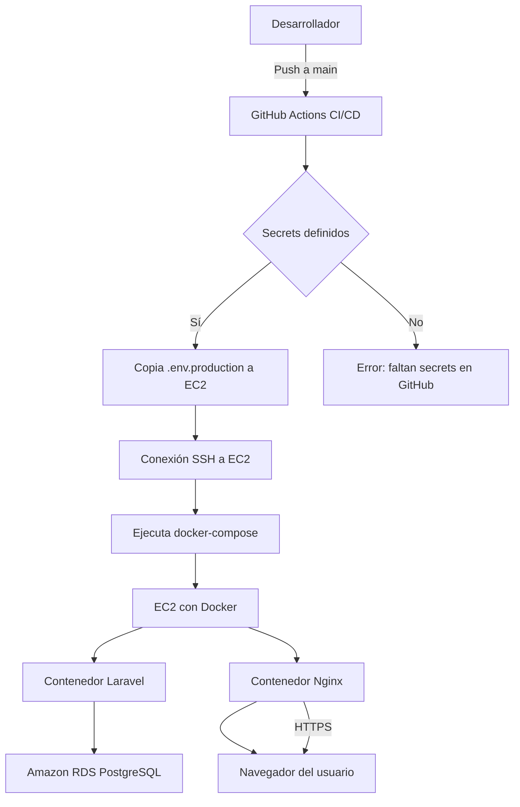

# 📚 BooksApp Laravel

Aplicación CRUD de libros desarrollada con Laravel 12, lista para desarrollo local y despliegue en producción con Docker, CI/CD, EC2 y RDS PostgreSQL.

Desarrollado por [mariodiaz-sv](https://github.com/mariodiaz-sv)

---

## 🛠️ Tecnologías

- Laravel 12
- PHP 8.3
- SQLite (desarrollo)
- PostgreSQL (producción – Amazon RDS)
- Docker & Docker Compose
- Nginx
- GitHub Actions (CI/CD)
- AWS EC2 (producción)
- SSL con certificados autofirmados

---

## 📊 Diagrama de arquitectura (Mermaid)



---

## 🚀 Requisitos

- PHP >= 8.3
- Composer
- Docker + Docker Compose
- Git
- Acceso a una instancia EC2 (Ubuntu)
- RDS PostgreSQL (Free Tier)

---

## 📦 Instalación local (desarrollo con SQLite)

1. Clona el repositorio:

```bash
git clone https://github.com/mariodiaz-sv/booksapp-laravel-aws.git
cd booksapp-laravel-aws
```

2. Instala las dependencias:

```bash
composer install
```

3. Copia el archivo de entorno:

```bash
cp .env.example .env
```

4. Configura `.env` con SQLite:

```env
DB_CONNECTION=sqlite
DB_DATABASE=/absolute/path/to/database/database.sqlite
```

> Crea el archivo `database/database.sqlite` vacío si no existe.

```bash
mkdir -p database
touch database/database.sqlite
```

5. Genera clave y migraciones:

```bash
php artisan key:generate
php artisan migrate
```

6. Inicia el servidor local:

```bash
php artisan serve
```

---

## 🐳 Docker en producción

### 1. Estructura de producción

- `Dockerfile.prod`: Define el contenedor de Laravel
- `docker-compose.prod.yml`: Laravel + Nginx + SSL
- `docker/nginx/default.conf`: Configuración de Nginx con HTTPS
- `.env.production`: Archivo de entorno para producción (fuera del repo)

### 2. Variables de entorno de producción (`.env.production`)

Ejemplo:

```env
APP_ENV=production
APP_KEY=base64:...
APP_DEBUG=false
APP_URL=https://TU_IP_EC2

DB_CONNECTION=pgsql
DB_HOST=tu-endpoint-rds.amazonaws.com
DB_PORT=5432
DB_DATABASE=booksapp_prod
DB_USERNAME=postgres
DB_PASSWORD=tu_password
```

---

## 🔐 Configuración Nginx con SSL autofirmado

El archivo `docker/nginx/default.conf` redirige HTTP a HTTPS y usa certificados autofirmados ubicados en:

```
docker/nginx/certs/selfsigned.crt
docker/nginx/certs/selfsigned.key
```

Se generan automáticamente durante el despliegue si no existen.

---

## ⚙️ Despliegue automático con GitHub Actions

El archivo [`deploy.yml`](.github/workflows/deploy.yml) realiza:

- Instalación de dependencias
- Verificación remota de Docker
- Limpieza del proyecto en EC2
- Clonación del repo
- Copia de `.env.production`
- Generación de certificados
- `docker-compose -f docker-compose.prod.yml up -d --build`
- Configuración final de Laravel

### Variables necesarias en GitHub Secrets:

- `EC2_HOST`: IP pública de tu EC2
- `EC2_SSH_KEY`: Llave privada (PEM) para acceso SSH

---

## 📂 Docker Compose Producción (`docker-compose.prod.yml`)

```yaml
services:
  app:
    build:
      context: .
      dockerfile: Dockerfile.prod
    image: booksapp-laravel-prod
    container_name: booksapp-laravel-prod
    restart: unless-stopped
    volumes:
      - .:/var/www/html
    networks:
      - booksapp

  nginx:
    image: nginx:alpine
    container_name: booksapp-nginx
    restart: unless-stopped
    ports:
      - "80:80"
      - "443:443"
    volumes:
      - .:/var/www/html
      - ./docker/nginx/default.conf:/etc/nginx/conf.d/default.conf
      - ./docker/nginx/certs:/etc/nginx/certs
    depends_on:
      - app
    networks:
      - booksapp

networks:
  booksapp:
    driver: bridge
```

---

## 🌐 Acceso en Producción

Después del despliegue exitoso, accede a tu app desde:

```
https://TU_IP_PUBLICA_EC2
```

> ⚠️ Al usar certificados autofirmados, tu navegador mostrará una advertencia de seguridad (puedes omitirla para pruebas).

---

## 🧪 Test Unitarios (opcional)

Puedes habilitar PHPUnit en GitHub Actions descomentando:

```yaml
# - name: Run Tests
#   run: vendor/bin/phpunit
```

Y ejecutarlos localmente:

```bash
php artisan test
```

---

## 📤 Desplegar manualmente desde tu máquina (opcional)

```bash
scp -i tu-clave.pem .env.production ubuntu@TU_IP:/home/ubuntu/.env.production
```

Luego haz push a `main` y GitHub Actions se encargará del resto.

---

## 📄 Licencia

MIT © 2025 [mariodiaz-sv](https://github.com/mariodiaz-sv)